# Artikel-Deteksi-Tingkat-Kematangan-Tomat
Membuat artikel tentang hasil projek deteksi dan klasifikasi tingkat kematangan tomat
# Revolusi Agrikultur: Deteksi Otomatis Kematangan Tomat dengan Deep Learning YOLOv8 

**Oleh:**  
Eva Fauziah  
Abdul Azis  
Komay Alamsyah  
Muhammad Fikri Firmansyah  

**Proyek Akhir Semester – Computer Vision**

  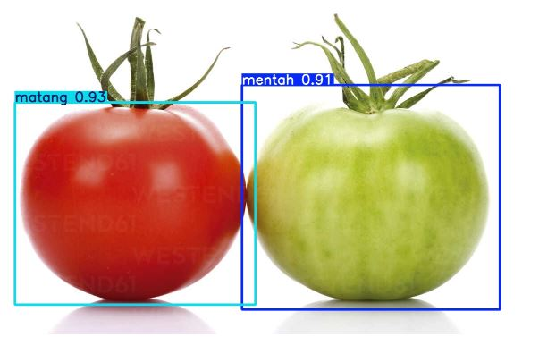
  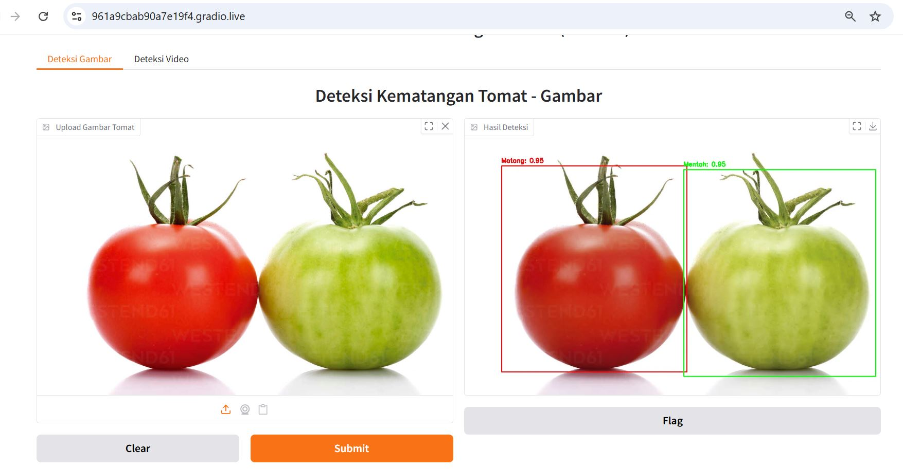

## Abstrak
Di industri pangan skala besar, kualitas tomat sangat ditentukan oleh ketepatan waktu panen. Namun, proses penentuan tingkat kematangan tomat secara manual masih bergantung pada inspeksi visual manusia yang bersifat subjektif, tidak konsisten, dan memakan waktu. Kesalahan penilaian ini dapat menyebabkan kerugian ekonomi akibat panen yang terlalu dini atau terlambat.

Melalui proyek akhir semester ini, kami mengembangkan solusi **Smart Farming berbasis Computer Vision** dengan memanfaatkan algoritma **YOLOv8** untuk mendeteksi dan mengklasifikasikan kematangan tomat secara otomatis dan real-time. Sistem ini dirancang sebagai prototipe yang mampu meningkatkan efisiensi, konsistensi, dan objektivitas dalam proses penyortiran hasil pertanian.

---

## 1. Pemilihan Model: Mengapa YOLOv8m?
Pada penelitian ini, kami memilih arsitektur **YOLOv8m (Medium)** sebagai model utama. Dengan sekitar **25,8 juta parameter**, YOLOv8m menawarkan keseimbangan optimal antara akurasi deteksi yang tinggi dan kecepatan inferensi yang cukup ringan untuk implementasi di lingkungan industri.

YOLOv8 dikenal sebagai model deteksi objek yang efisien karena mampu melakukan proses deteksi dalam satu tahap (*single-stage detector*), sehingga sangat cocok untuk kebutuhan **real-time system** seperti mesin penyortir otomatis atau robot pemanen.

---

## 2. Analisis Data: Lebih dari Sekadar Gambar
Sebelum proses pelatihan model, kami melakukan analisis mendalam terhadap **177 citra digital**, dengan total **354 file** termasuk anotasi. Tahapan analisis ini bertujuan untuk memahami karakteristik visual tomat serta meningkatkan kualitas dataset.

### 2.1 Analisis Warna (RGB)
Hasil analisis menunjukkan bahwa:
- **Tomat matang** memiliki dominansi kanal **Merah (Red)** yang kuat.

  

- **Tomat mentah** lebih didominasi kanal **Hijau (Green)**.
 

  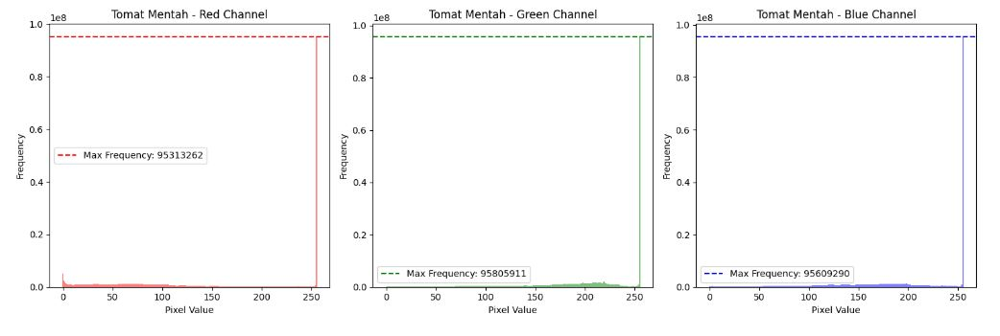

Perbedaan distribusi warna ini mencerminkan proses fisiologis dan biokimia selama pematangan tomat. Informasi warna tersebut menjadi fitur penting yang dimanfaatkan oleh model untuk membedakan tingkat kematangan.

### 2.2 Deteksi Tepi (Edge Detection)

  

Kami menguji metode deteksi tepi seperti canny dan Sobel untuk memahami kontur dan bentuk tomat. Analisis ini membantu memastikan bahwa model mampu mengenali batas objek dengan lebih baik, terutama pada kondisi lingkungan yang kompleks atau latar belakang yang bervariasi.

  

Dari uraian di atas, kita dapat melihat frekuensi dan kepadatan tepi dari setiap teknik. Untuk mendeteksi detail yang lebih halus atau tepi yang lebih kuat, frekuensi yang lebih tinggi lebih baik.

### 2.3 Dataset Seimbang

  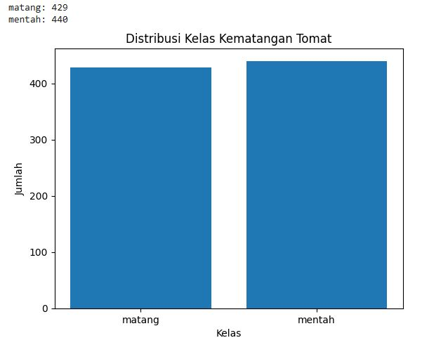

Dataset yang digunakan terdiri dari 440 objek tomat mentah dan 429 objek tomat matang.

Distribusi yang seimbang ini penting untuk menghindari bias model terhadap salah satu kelas dan meningkatkan kemampuan generalisasi sistem.

---
### 2.4 Rata-Rata Dimensi Gambar

  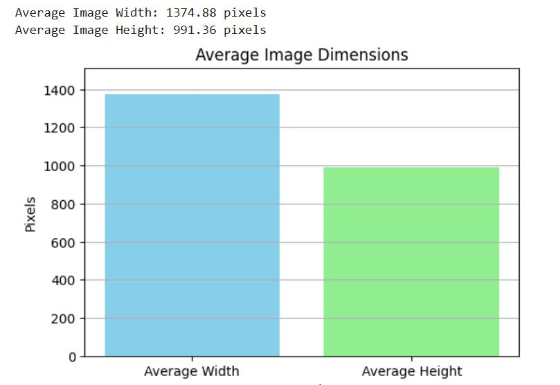

Lebar gambar 1374,88 piksel dan Tinggi 991,36 piksel. Analisis ukuran gambar dataset ini juga penting agar memahami karakteristik resolusi data.

---

## 3. Proses Pelatihan dan Evaluasi Model
Model dilatih selama **150 epoch** dengan dukungan GPU. Evaluasi performa dilakukan menggunakan metrik **Intersection over Union (IoU)**, yang mengukur tingkat tumpang tindih antara bounding box prediksi dan ground truth:

  

### 3.1 Hasil Performa Model
Pengujian pada data yang benar-benar baru menunjukkan hasil yang sangat memuaskan:
- **Precision: 89,9%**  
  Hampir 90% prediksi yang dihasilkan model adalah benar.
- **Recall: 81%**  
  Model berhasil mendeteksi sebagian besar objek tomat yang ada.
- **mAP@0.5: 91,8%**  
  Menunjukkan akurasi deteksi yang sangat tinggi dan sebanding dengan model deteksi kematangan kelas *state-of-the-art*.

---
### 3.2 Hasil Confusion Matrix

  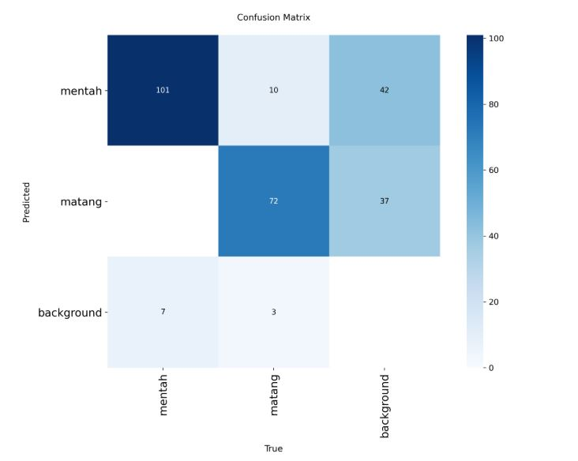

Dari hasil Confusion Matrix, model menunjukkan performa klasifikasi yang sangat baik pada data evaluasi, ditandai dengan tingginya jumlah prediksi benar pada kelas tomat mentah dan matang serta tidak ditemukannya kesalahan deteksi tomat matang sebagai mentah. Kesalahan yang terjadi sebagian besar disebabkan oleh faktor oklusi dan kondisi pencahayaan yang menyebabkan objek tidak terdeteksi (False Negative), serta kompleksitas latar belakang perkebunan yang memicu kesalahan deteksi objek non-tomat sebagai tomat (False Positive). Contoh gambar berikut, dimana daun terdeteksi sebagai buah mentah:

  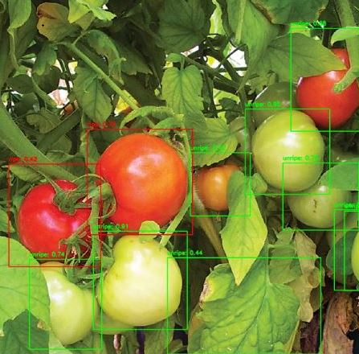

### 3.3 Hasil Perbandingan Performa Model
#### Hasil Evaluasi Kinerja Model YOLOv8

| Kategori | Metrik / Tahap | Training | Evaluasi |
|---------|---------------|----------|----------|
| **All Class** | Precision | 0,899 | 0,901 |
|  | Recall | 0,810 | 0,844 |
|  | mAP@0.5 | 0,918 | 0,916 |
|  | mAP@0.5:0.95 | 0,590 | 0,590 |
| **Mentah** | Precision | 0,826 | 0,861 |
|  | Recall | 0,926 | 0,926 |
|  | mAP@0.5 | 0,925 | 0,921 |
|  | mAP@0.5:0.95 | 0,595 | 0,589 |
| **Matang** | Precision | 0,971 | 0,942 |
|  | Recall | 0,694 | 0,762 |
|  | mAP@0.5 | 0,912 | 0,911 |
|  | mAP@0.5:0.95 | 0,585 | 0,590 |
| **Kecepatan** | Preprocessing | 0,2 ms | 5,1 ms |
|  | Inferensi | 24,3 ms | 27,1 ms |
|  | Postprocessing | 1,6 ms | 2,2 ms |

---
Model YOLOv8 menunjukkan generalisasi yang baik karena performa pada tahap evaluasi setara atau sedikit lebih baik dibandingkan training, dengan nilai akurasi (mAP) yang stabil dan konsisten. Model sangat andal mendeteksi tomat mentah (recall tinggi) dan akurat dalam mendeteksi tomat matang (precision tinggi), dengan peningkatan kemampuan menemukan objek matang pada data evaluasi. Dari sisi kecepatan, meskipun inferensi evaluasi sedikit lebih lambat, model tetap efisien dan layak untuk aplikasi real-time.

## 4. Keunggulan Sistem Real-Time
Salah satu keunggulan utama sistem ini adalah **kecepatan inferensi**. Model hanya membutuhkan **24,3 ms** untuk satu kali proses deteksi, yang berarti mampu memproses sekitar **40 frame per detik (FPS)**.

Kecepatan ini menjadikan sistem sangat ideal untuk:
- Mesin penyortir otomatis
- Robot pemanen
- Sistem monitoring pertanian berbasis kamera

---
##  Notebook Eksperimen
#### Hasil Testing 

  
  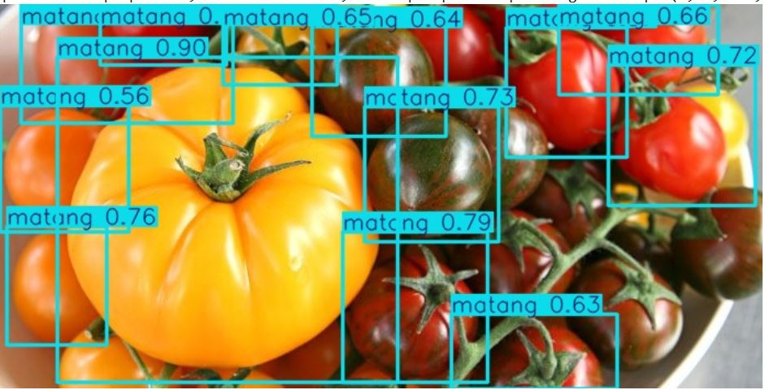
  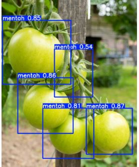

#### Notebook ini berisi proses:

- Preprocessing dataset
- Training YOLOv8
- Evaluasi model
- Visualisasi hasil deteksi

## Demo Model
#### Hasil Web Kamera

  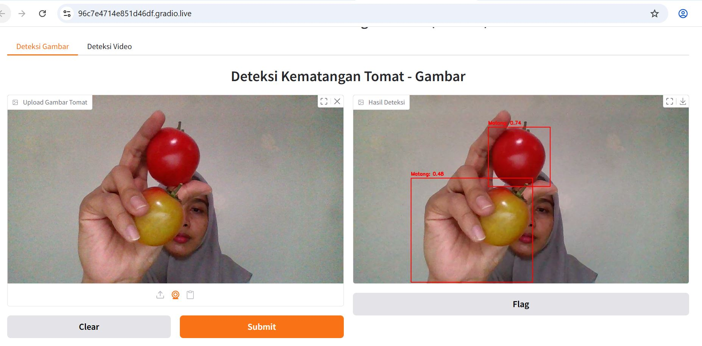

#### Hasil Video

  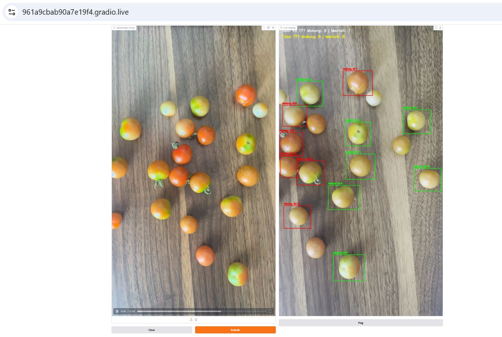

#### Demo Deteksi Tomat 

## Dataset

Dataset yang digunakan dalam penelitian ini mengacu pada sumber publik dari Kaggle yang menyediakan citra tomat matang dan mentah untuk keperluan deteksi objek.

**Sumber dataset:**  
[Dataset Deteksi Tomat (Kaggle)](https://www.kaggle.com/code/sumn2u/yolo-v8-ripe-and-unripe-tomatoes-detection)

## 5. Kesimpulan dan Insight
Berdasarkan hasil evaluasi menggunakan **Confusion Matrix**, model menunjukkan kemampuan klasifikasi yang sangat kuat. Tidak ditemukan kasus tomat matang yang salah diklasifikasikan sebagai tomat mentah. Meskipun terdapat tantangan pada kondisi oklusi (objek terhalang daun atau batang), sistem secara keseluruhan telah menunjukkan performa yang sangat layak untuk menggantikan inspeksi manual.

---

## Penutup
Inovasi ini membuktikan bahwa penerapan **Computer Vision dan Deep Learning** mampu meningkatkan efisiensi serta objektivitas dalam industri pertanian, khususnya di Indonesia. Kami berharap pengembangan sistem ini dapat menjadi langkah awal menuju otomatisasi proses pangan yang lebih cerdas, modern, dan berkelanjutan.

---
## Daftar Referensi

1. Andityaa, I. G. M. W., & Mastrika, G. A. V. (2025). *Klasifikasi Kematangan Tomat pada Citra Digital Menggunakan DeiT (Data-efficient Image Transformer).* **JNATIA (Jurnal Nasional Teknologi Informasi dan Aplikasinya), 3**(4), 737–744.  
2. Aras, S., Tanra, P., & Bazhar, M. (2024). *Detection of Tomato Fruit Ripeness Level Using YOLOv5.* **MALCOM: Indonesian Journal of Machine Learning and Computer Science, 4**(2), 623–628.  
3. Alfian, L., & Paputungan, I. V. (2025). *Deteksi Kematangan Tomat Menggunakan Algoritma Deteksi Objek (YOLO) 11.* **Edusaintek: Jurnal Pendidikan, Sains dan Teknologi, 12**(4), 1923–1938.  
4. Fauzi, R. D., & Fachrie, M. (2024). *Sistem Prediksi Tingkat Kematangan Buah Tomat Menggunakan Arsitektur VGG16.* **Djtechno: Jurnal Teknologi Informasi, 5**(3), 438–446.  
5. Wang, S., Xiang, J., Chen, D., & Zhang, C. (2024). *A Method for Detecting Tomato Maturity Based on Deep Learning.* **Applied Sciences, 14**(23), 11111.  
6. Yang, Z., Li, Y., Han, Q., Wang, H., Li, C., & Wu, Z. (2025). *A Method for Tomato Ripeness Recognition and Detection Based on an Improved YOLOv8 Model.* **Horticulturae, 11**(1), 15.

